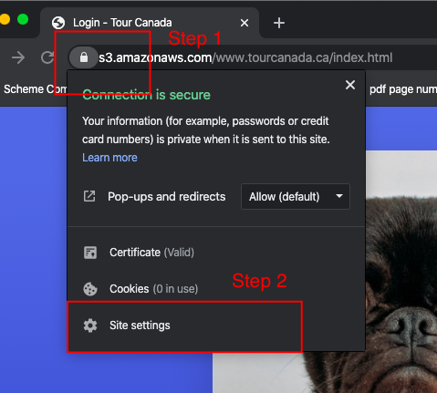
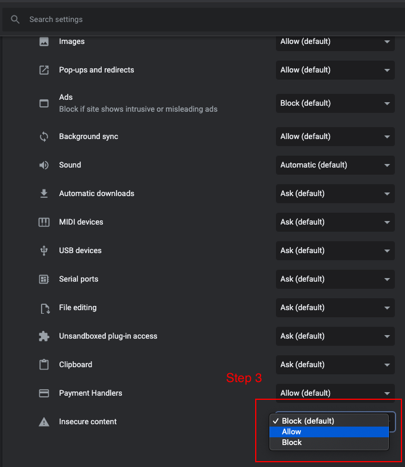

# TourCanada

> The folder "frontend" contains the code of the website's frontend.

To run the api on localhost:
* `clone the repo`
* `cd 'TourCanada-API`
* `python app.py`.

<b>Link to website:</b> https://s3.amazonaws.com/www.tourcanada.ca/index.html

## If you are opening the above website for the first time you need to make the following changes in the browser settings(preferably Google Chrome):
```
The reason we need to do this is because the frontend of the website is HTTPS certified and the APIs which are 
hosted on Elastic Beanstalk are not HTTPS certified.
```
 * Open https://s3.amazonaws.com/www.tourcanada.ca/index.html.
 * Click on the lock and then click on the site settings as show in the image below
 
 * Scroll all the way down to the page opened after step 1.
 * Change `Insecure content` to `Allow`.
 
 * Close the tab and then refresh the page.
 Now you can use all the functionalities of the website.
 
 
API endpoints for Tour Canada.

| **Endpoint** | **Type** | **Parameters** | **On success response** |
| --- | --- | --- | --- |
| **/register** | POST | username, name, email | _{_
&#39;status&#39;: True,
 &#39;code&#39;: 200,
 &#39;message&#39;: &quot;Success message&quot;,
 &#39;result&#39;: {}
_}_(this endpoint does not return anything in result) |
| **/getUserDetails** | GET | username | _{
 &quot;_ status&quot;: True,
 &quot;code&quot;: 200,
 &#39;message&#39;: &quot;Success message&quot;,
 &quot;result&quot;: _{
 &quot;_ name&quot;: &quot;John Doe&quot;,
&quot;email&quot;:
 &quot;johndoe@example.com&quot;,
 _}_
_}_ |
| **/getTrendingLocations** | GET | N/A | _{ __&quot;status&quot;: true,__&quot;code&quot;: 200, __&quot;message&quot;: &quot;Trending locations fetched successfully&quot;,__&quot;result&quot;: [__[__{ __&quot;photoURL&quot;: url\_to\_photo&quot;,__&quot;location&quot;: &quot;Halifax&quot; __},__ { __&quot;photoURL&quot;: url\_to\_photo&quot;,__&quot;location&quot;: &quot;Vancouver&quot; __},__ { __&quot;photoURL&quot;: &quot; url\_to\_photo&quot;,__&quot;location&quot;: &quot;Toronto&quot; __}__],__[__{ __&quot;photoURL&quot;: &quot; url\_to\_photo &quot;,__&quot;location&quot;: &quot;Cape Breton&quot; __},__ { __&quot;photoURL&quot;: &quot;__ url\_to\_photo&quot;, __&quot;location&quot;: &quot;Waterloo&quot;__ }, __{__&quot;photoURL&quot;: &quot; __url\_to\_photo &quot;,__&quot;location&quot;: &quot;Montreal&quot; __}__]__]__}_Note: In results, there is a 2-D list (where inner one is of length 3) which contains dictionary of search results for location. |
| **/destinations** | GET | location (eg: halifax) | _{ __&quot;status&quot;: true,__&quot;code&quot;: 200, __&quot;message&quot;: &quot;Trending locations fetched successfully&quot;,__&quot;result&quot;: [__[__{ __&quot;photoURL&quot;: url\_to\_photo&quot;,__&quot;location&quot;: &quot;Point Pleasant Park&quot; __},__ { __&quot;photoURL&quot;: url\_to\_photo&quot;,__&quot;location&quot;: &quot;Halifax Citadel&quot; __},__ { __&quot;photoURL&quot;: &quot; url\_to\_photo&quot;,__&quot;location&quot;: &quot;Black Rock Beach&quot; __}__]__]__}_Note: In results, there is a 2-D list( where inner one is of length 3) which contains dictionary of search results for location. |
| **/make\_payment** | POST | user\_id,
 username,
 location,
 place,
 numTickets,
 amount,
 date
 | {&quot;status&quot;: true,&quot;code&quot;: 200,&quot;message&quot;: &quot;Booking inserted successfully!&quot;,&quot;result&quot;: {&quot;uid&quot;: 126948,}} |
| **/get\_image\_url** | GET | user\_id(Stored in cognito userpool) | {&quot;status&quot;: true,&quot;code&quot;: 200,&quot;message&quot;: &quot;Image fetched successfully!&quot;,&quot;result&quot;: { &quot;img\_url&quot;: base64 encoded urlfor the image of qrcode storedin s3.}} |
| **/get\_my\_bookings** | GET | user\_id(Stored in cognito userpool) | {&quot;status&quot;: true,&quot;code&quot;: 200,&quot;message&quot;: &quot;Bookings fetched Successful!&quot;,&quot;result&quot;: [[{&quot;date\_ticket&quot;: &quot;2020-04-15&quot;,&quot;ticket\_location&quot;: &quot;Point Pleasant Park&quot;,&quot;user\_id&quot;: &quot;3aa2f70d-30d6-46a7-aa13-e688f4fe468d&quot;,&quot;numTickets&quot;: &quot;1&quot;,&quot;img\_url&quot;: base64 encoded urlfor the image of qrcode storedin s3.,&quot;ticket\_city&quot;: &quot;Halifax&quot;,&quot;username&quot;: &quot;daksh2298&quot;,&quot;amount\_ticket&quot;: &quot;$12&quot;,&quot;id&quot;: 126948},]]}Note: In results, there is a 2-D list( where inner one is of length 3) which contains dictionary of search results for location. |